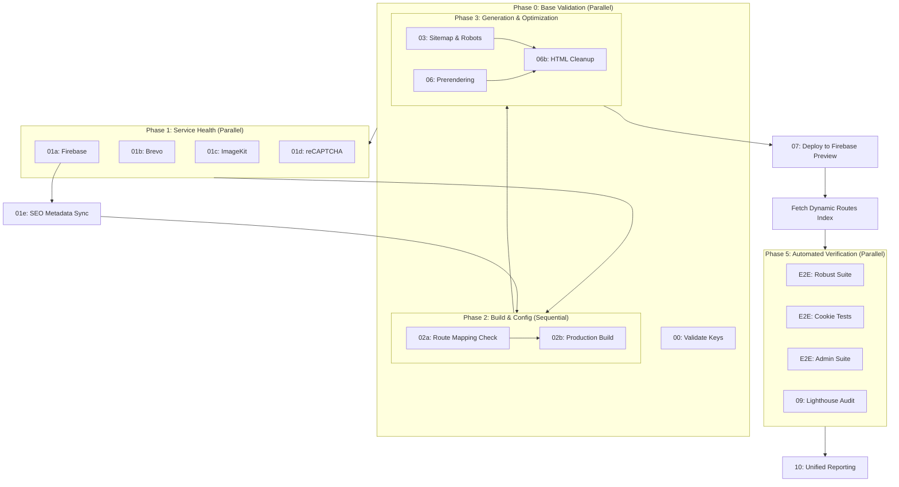

# Complete Pipeline Test Guide

## 🎯 One-Command Full Validation

```bash
npm run test:pipeline
```

**This single command executes the ENTIRE workflow:**

1. ✅ **Local Validation**
   - Linting
   - Build
   - SEO Generation
   - (Optional: Tests with Firebase)

2. ✅ **Git Workflow**
   - Create feature branch
   - Stage all changes
   - Commit with timestamp
   - Push to GitHub

3. ✅ **Pull Request**
   - Automatic PR creation
   - Descriptive title & body

4. ✅ **GitHub Actions**
   - Monitor CI/CD pipeline
   - Wait for all checks to pass

5. ✅ **Auto-Merge**
   - Enable auto-merge on success
   - Squash commits

---

## 🏗️ Pipeline Architecture & Dependencies

The following graph visualizes the automated dependency resolution. By using NX Targets, any high-level command (like `nx e2e`) will automatically trigger all necessary prerequisites in the correct order.



---

## 📋 What Gets Validated

### Local Checks

- TypeScript compilation
- ESLint rules
- Vite build
- SEO file generation
- (Future: E2E tests, RBAC tests)

### GitHub Actions Checks

- PR validation workflow
- Lint checks
- Build verification
- (Future: Deployment preview)

---

## 🚀 Usage

### For New Customer Projects

```bash
# After initial setup
npm run test:pipeline

# Output:
# 🚀 Starting Complete End-to-End Pipeline
# ═══════════════════════════════════════
# 📋 PHASE 1: Local Validation
# ✅ Linting - Success
# ✅ Building - Success
# ✅ SEO Generation - Success
# 📋 PHASE 2: Git Workflow
# ✅ Create Feature Branch - Success
# ✅ Push to GitHub - Success
# 📋 PHASE 3: Pull Request & GitHub Actions
# ✅ Create Pull Request - Success
# ⏳ Waiting for GitHub Actions...
# ✅ All checks passed
# 📋 PHASE 4: Auto-Merge
# ✅ Auto-merge enabled
# 🎉 Complete Pipeline Test Successful!
```

### Before Client Handover

```bash
npm run test:pipeline
# Ensures everything works end-to-end
```

---

## ⚙️ Configuration

### Required Tools

- `gh` CLI (GitHub CLI)
- Git configured with remote
- GitHub repository with Actions enabled

### Setup

```bash
# Install GitHub CLI
winget install GitHub.cli

# Authenticate
gh auth login
```

---

## 🔧 Customization

Edit `scripts/test-complete-pipeline.ts` to:

- Add more validation steps
- Customize PR template
- Add deployment steps
- Configure merge strategy

---

## 📊 Success Criteria

Pipeline passes when:

- ✅ All local builds succeed
- ✅ No lint errors
- ✅ Git operations complete
- ✅ PR created successfully
- ✅ All GitHub Actions checks pass
- ✅ Auto-merge enabled

---

## 🎯 Purpose

This ensures that **every customer project** is:

- Properly configured
- Passes all quality checks
- Ready for production deployment
- CI/CD pipeline functional

**One command = Full confidence in project state!** 🚀
